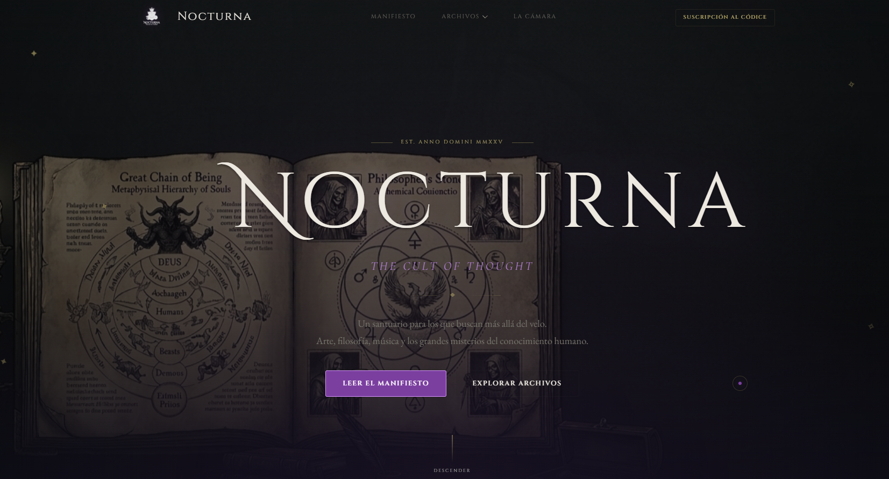

# Nocturna — The Cult of Thought

An immersive landing page inspired by gothic aesthetics, philosophy, art and symbolism, developed with HTML, CSS and JavaScript. Currently under active development.

## Technologies

- HTML5
- CSS3
- JavaScript (ES6)
- Git
## Live Demo
https://moongelion.github.io/nocturna/
## Run locally

```bash
git clone https://github.com/moongelion/nocturna.git
```

Open `index.html` in your browser.

## Author

Luna 

GitHub: https://github.com/moongelion
